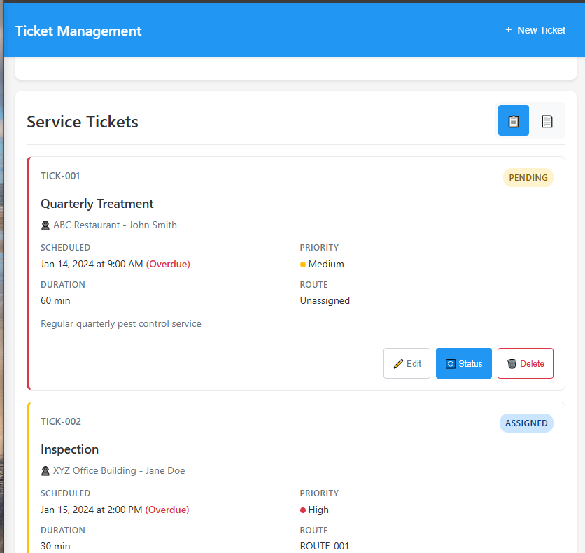

[edit]()
# hwpc-gs project
update old delphi program to run mobile

- ghadmin [https://github.com/grasshorse/hwpc-gs](https://github.com/grasshorse/hwpc-gs)

## Demo links
- need [ghadmin zerotier approval](https://my.zerotier.com/network/d5e5fb65371eb4a4)

---
- [http://10.147.17.219:8000/tickets/?demo=true](http://10.147.17.219:8000/tickets/?demo=true)

- [http://10.147.17.219:8000/customers/?demo=true](http://10.147.17.219:8000/customers/?demo=true)

- [http://10.147.17.219:8000/routes/?demo=true](http://10.147.17.219:8000/routes/?demo=true)

