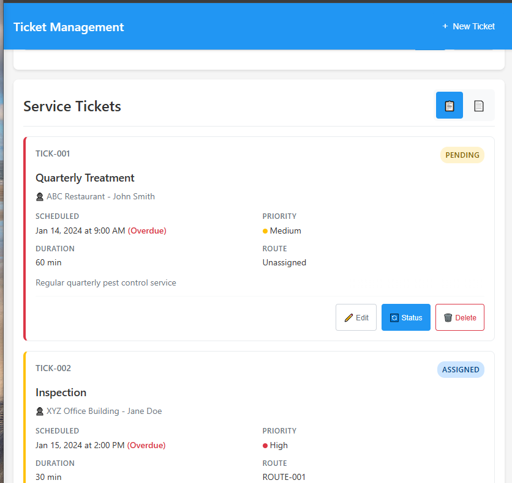
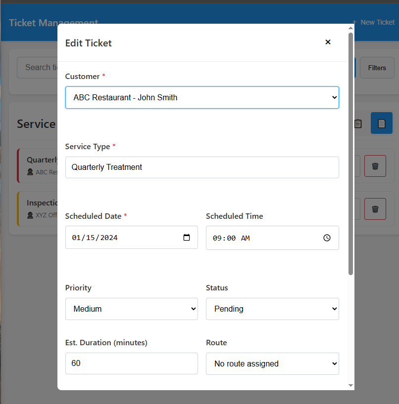
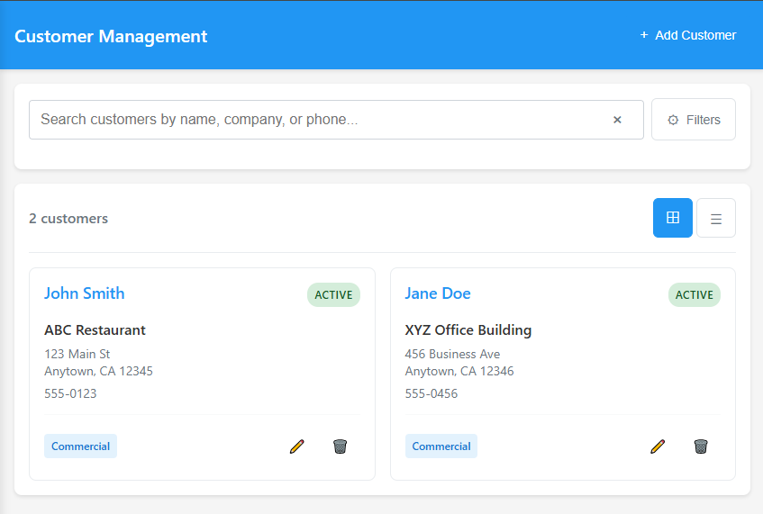
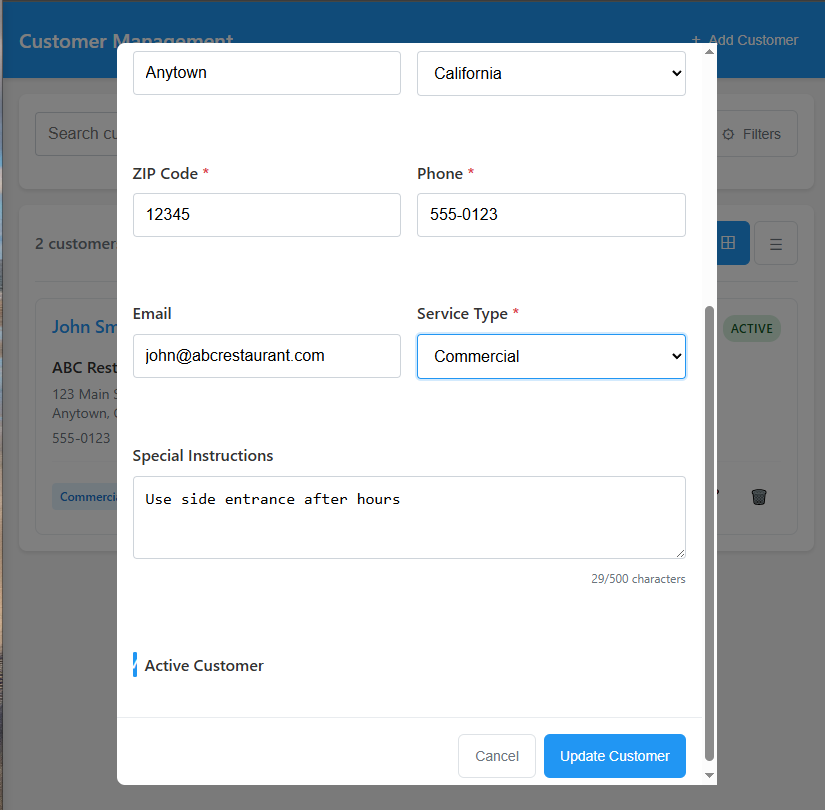
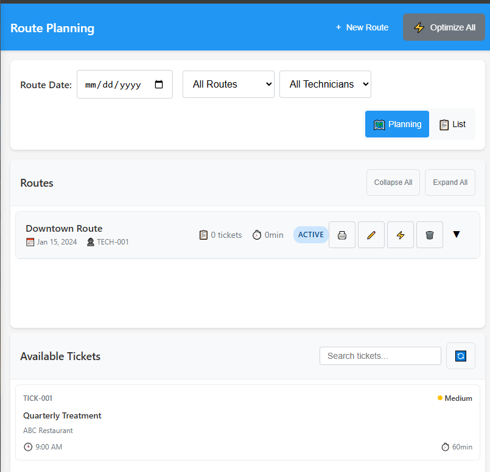
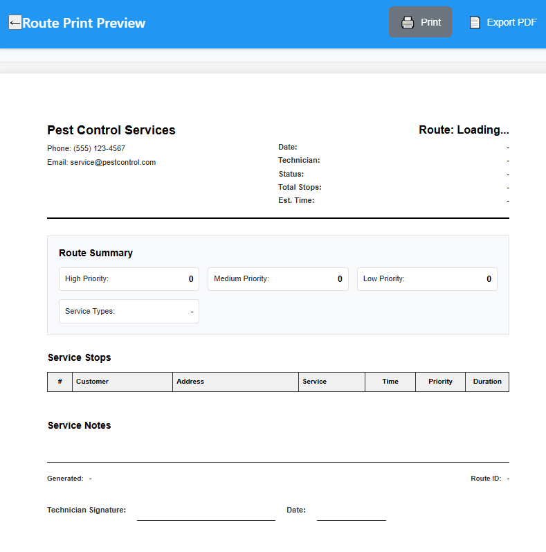
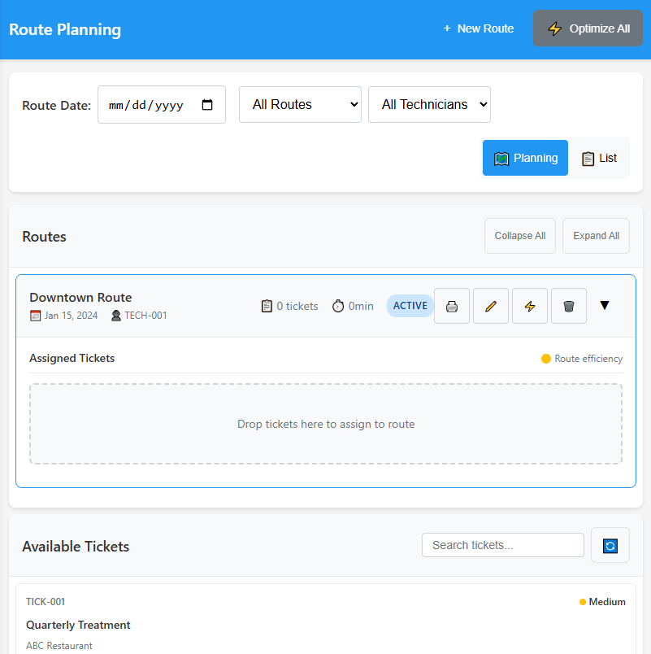

[edit](https://github.com/2cld/hwpc/edit/master/docs/hwpc-gs/README.md)

# hwpc-gs project

Update old Delphi program to run mobile.

- Source: [grasshorse/hwpc-gs](https://github.com/grasshorse/hwpc-gs) (private — request access from ghadmin)

## Demo Access

Demo requires ZeroTier network access — contact ghadmin for approval.

Once connected, the demo server runs on the internal network (see team channel for IP and port).

## Screenshots

### Tickets

### Customers

### Routes

